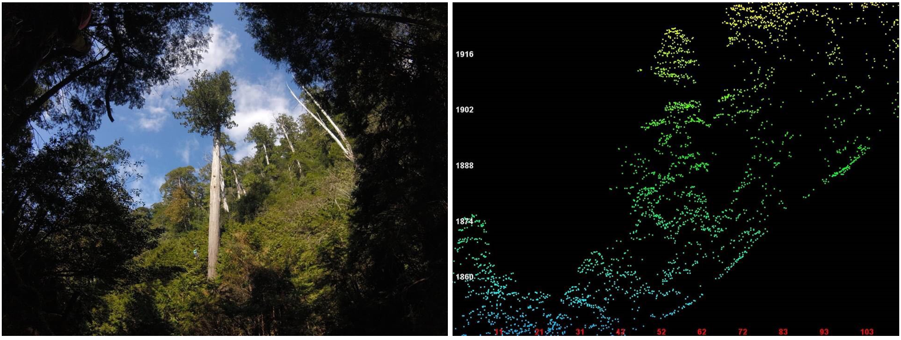
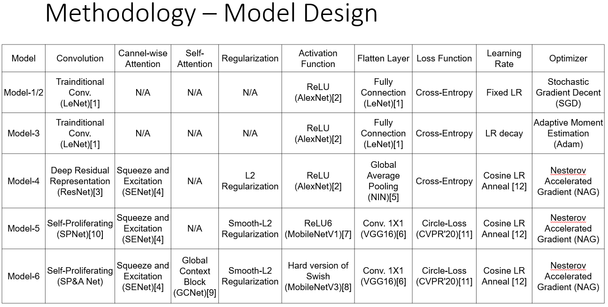
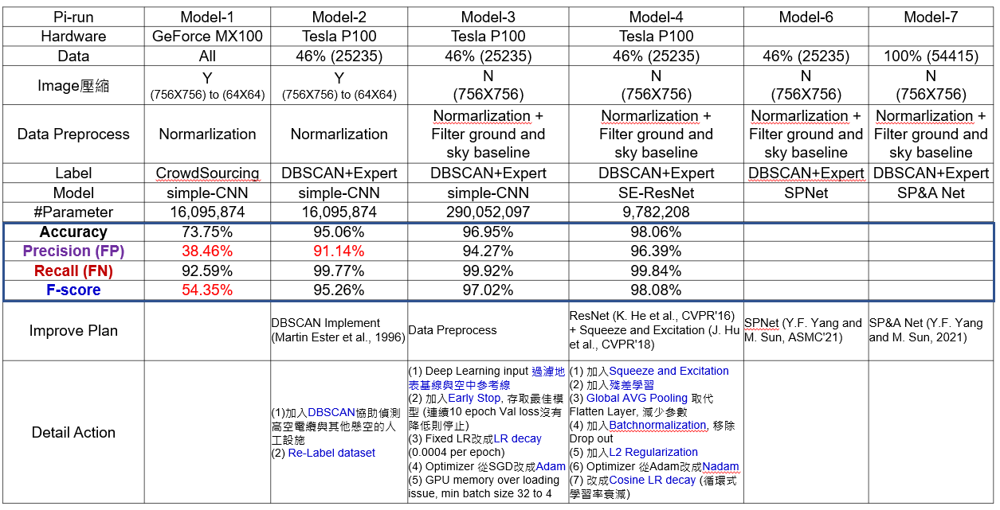
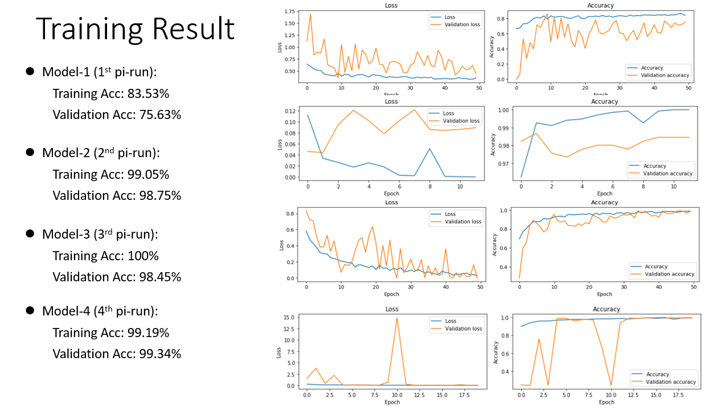

# Looking for the Tallest Tree in Taiwan by Deep Learning
This project uses deep learning to find the tallest tree in Taiwan. Based on the reasonable growth space of trees (1200 trees per hectare), it is estimated that there should be 2.5 billion trees in Taiwan. Of course, this is just a reference value that cannot be confirmed. How to find a giant tree with a height of more than 70 meters among billions of trees and achieve "Finding the tallest tree in Taiwan" is an interesting ecological issue.

The research team of the Taiwan Forestry Research Institute used a telemetry instrument ─ ─ airborne LiDAR to quickly scan the forest trees to obtain a large amount of image data. Secondly, through crowdSourcing, a large amount of image data was labeled (around 55,000 photos). We hope to use machine learning to build models to find the tallest tree in Taiwan from hundreds of thousands of airborne LiDAR images.

##### Picture-1: Taiwania cryptomerioides "Big White" and its airborne LiDAR diagram.



## Re-Label by DBSCAN
Through outsourcing data, it is inevitable that there will be some wrongly marked data (False Negative/False Positive). We have studied several types of Unsupervised Learning (for details, please refer to: `KMean_DBSCAN_HoughLine_Study.ipynb`) and found that DBSCAN can effectively filter with dangling Images of artificial structures (such as cables). It can help us clean up the data before deep learning (please refer to the implementation results: `DBSCAN.ipynb`).

## Deep Learning
Next, we conduct deep learning to distinguish between artificial buildings and natural tree groups. So far, we have tested a total of 4 models (please refer to: `model1.ipynb`, `model2.ipynb`, `model3.ipynb`, `model4.ipynb`). Current accuracy/Recall/Precision/F1-Score reached **98.06%**/**99.84%**/**96.39%**/**98.08%** respectively.

## Code

### Install dependencies

```
python -m pip install -r requirements.txt
```

This code was tested with python 3.7  


## Script Introduction

```KMean_DBSCAN_HoughLine_Study.ipynb``` is the script which detail study unsupervised learning model.

```DBSCAN.ipynb``` is used to produce the result of grouping based on DBSCAN.

```model1.ipynb```,```model2.ipynb```,```model3.ipynb```,```model4.ipynb``` are the pi-run result of 4 deep leanring models.

### SEResNet Folder
```SE_block.py``` is the Squeeze and Excitation block to auto select importance feature map.

```Res_block.py``` is the deep residual learning block.

```SE_ResNet.py``` is the deep residual learning block with Squeeze and Excitation whick used to build the overall SEResNet architecture.


### SPNet Folder
```Self_Proliferate.py``` is used to generate more feature maps (As paper section 3.1).

```Self_Attention.py``` is used to capturing the long-range dependencies of the feature map (As paper secton 3.2).

```Self_Proliferate_and_Attention.py``` follow the spirit of MobileNet,  "capture features in high dimensions and transfer information in low dimensions",  to make the network more efficient. (As paper secton 3.3).

```SPA_Net.py``` is the overall network architecture of SP&A-Net. Please refer section 3.4 of this paper.

## Model Design



## Experiment Result



### Training Result


### Reference
* [1] Y. Lecun, L. Bottou, Y. Bengio and P. Haffner, "Gradient-based learning applied to document recognition", in Proceedings of the IEEE, vol. 86, no. 11, pp. 2278-2324, Nov. 1998.
* [2] A. Krizhevsky, I. Sutskever, G. E. Hinton, "ImageNet classification with deep convolutional neural networks", Advances in Neural Information Processing Systems (NIPS), 2012.
* [3] K. He, X. Zhang, S. Ren and J. Sun, "Deep Residual Learning for Image Recognition", 2016 IEEE Conference on Computer Vision and Pattern Recognition (CVPR), pp. 770-778, Jun. 2016.
* [4] J. Hu, L. Shen and G. Sun, "Squeeze-and-Excitation Networks", 2018 IEEE/CVF Conference on Computer Vision and Pattern Recognition (CVPR), pp. 7132-7141, Jun. 2018.
* [5] M. Lin, Q. Chen, S. Yan, "Network In Network", International Conference on Learning Representations (ICLR) 2014.
* [6] K. Simonyan, A. Zisserman, "Very Deep Convolutional Networks for Large-Scale Image Recognition", International Conference on Learning Representations(ICLR), 2015.
* [7] A. G. Howard, M. Zhu, B. Chen, et al., "MobileNets: Efficient Convolutional Neural Networks for Mobile Vision Applications", arXiv preprint arXiv:1704.04861, Apr 2017.
* [8] A. Howard et al., "Searching for MobileNetV3", 2019 IEEE/CVF International Conference on Computer Vision (ICCV), pp. 1314-1324, Nov. 2019.
* [9] Y. Cao, J. Xu, S. Lin, F. Wei and H. Hu, "GCNet: Non-Local Networks Meet Squeeze-Excitation Networks and Beyond", 2019 IEEE/CVF International Conference on Computer Vision Workshop (ICCVW), pp. 1971-1980, 2019.
* [10] Y.F. Yang, M. Sun, "A Novel Deep Learning Architecture for Global Defect Classification: Self-Proliferating Neural Network (SPNet)", 2020 31th Annual SEMI Advanced Semiconductor Manufacturing Conference (ASMC), May 2021.
* [11] Y. Sun et al., "Circle Loss: A Unified Perspective of Pair Similarity Optimization", 2020 IEEE/CVF Conference on Computer Vision and Pattern Recognition (CVPR), pp. 6397-6406, Jun. 2020.
* [12] I. Loshchilov, F. Hutter, “SGDR: Stochastic Gradient Descent with Warm Restarts”, International Conference on Learning Representations (ICLR), May 2017.
* [13] S. loffe, C. Szegedy, "Batch Normalization: Accelerating Deep Network Training by Reducing Internal Covariate Shift", International Conference on Machine Learning (ICML), 2015.
* [14] M. Sandler, A. Howard, M. Zhu, A. Zhmoginov and L. Chen, "MobileNetV2: Inverted Residuals and Linear Bottlenecks", 2018 IEEE/CVF Computer Vision and Pattern Recognition Conference (CVPR), pp. 4510-4520, Jun. 2018.
